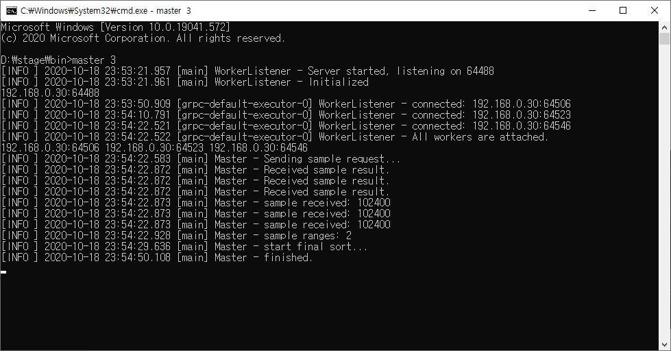
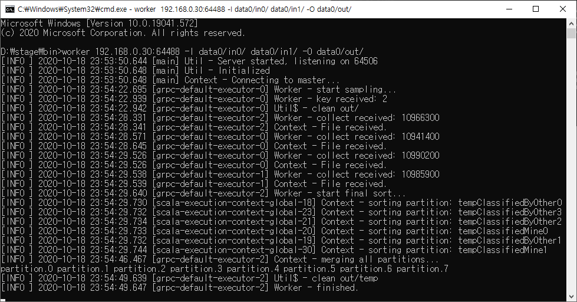

# Project Milestone 1

2020/10/19 권영민 [https://github.com/ymfact/cs434-project/tree/milestone1](https://github.com/ymfact/cs434-project/tree/milestone1)

# 기능

각 워커들은 1024개 레코드를 샘플하여 정렬 후 마스터에게 보냅니다.

마스터는 수신한 레코드들을 정렬하여 파티셔닝에 필요한 정보를 워커에게 보냅니다.

워커는 인풋 폴더의 데이터를 정렬하여 파티션대로 각 워커에게 보냅니다.

워커는 자기 파티션의 데이터와 수신하는 데이터를 아웃풋 폴더에 임시로 저장합니다.

임시로 저장된 데이터를 종합하여 결과를 아웃풋 폴더에 저장합니다.

# 빌드

sbt shell에서 stage를 입력하면 실행할 수 있는 파일이 생성됩니다.

- cs434-project/master/target/universal/stage/bin/master.bat
- cs434-project/worker/target/universal/stage/bin/worker.bat

# 실행

실행에 앞서 모든 인풋 폴더가 이미 존재해 있어야 합니다.

입력 데이터는 gensort로 생성된 데이터로서 인풋 폴더에 이미 존재해 있어야 합니다.

인풋 폴더 각각에는 그 밖의 데이터가 존재해서는 안됩니다.

아웃풋 파일의 크기는 8MiB가 조금 안되는 8,388,600 Bytes이며, 이는 캐시를 고려한 크기입니다.

## Master

워커 카운트를 인자로 넣어 실행합니다.

자신의 IP와 포트가 표시됩니다. 이 값을 워커에 입력합니다.

워커가 모두 연결되면 워커들의 주소가 화면에 표시됩니다.

화면에 표시된 INFO들은 master.log 파일로도 저장됩니다.

## Worker

마스터가 이미 실행되어 있어야 합니다.

마스터의 주소, 인풋 폴더, 아웃풋 폴더를 인자로 넣어 실행합니다.

아웃풋 폴더는 자동으로 생성되며, 이미 파일이 있는 경우 모두 지워집니다.

정렬이 모두 완료되면 결과 파일 이름이 화면에 표시됩니다.

화면에 표시된 INFO들은 아웃풋 폴더의 log.log 파일로도 저장됩니다.

# Notes

## Record

Record 타입은 두 개가 되어 불필요한 캐스팅을 막는다.

본래 Array, ByteString, Stream 각각으로부터 얻은 레코드를 클래스 세 개로 만드려 했다. 세 곳에서 얻은 레코드는 불필요한 캐스팅을 막기 위해 클래스를 나눌 필요가 있었다.

Array에서 가져온 애들은 사실상 포인터로서, RecordArray로부터 분리되는 메모리를 갖지 않는다. 파일로부터 어레이를 읽어온 뒤, in-memory 정렬 중에 비교 연산자, 대입 연산자를 사용하기 위해 비교할 때마다 생성하여 사용하였다. 하지만 효용성에 비해 오버헤드가 크다고 판단하여, `RecordArray::compareRecord`, `RecordArray::patchInPlace` 가 되었다.

Tip: ByteString은 substring 코스트가 없다.

## Merge sort

재귀를 사용하지 않는다.

nlogn의 머지소트는 과정 중에 별도의 추가 공간 n개가 필요하다. Conquer 매번마다 데이터는 원래 공간과 추가 공간을 번갈아가며 이동한다. 하지만 재귀를 사용한 머지소트는 데이터 위치에 따라 Conquer 횟수가 달라질 수 있다. 결과적으로 데이터가 최종적으로 추가 공간에 있는지, 아니면 원래 공간에 있는지가 데이터 위치마다 달라지는 현상이 생길 수 있고, 이를 막기 위해 재귀가 아닌 스텝마다의 정렬을 사용하게 되었다.

## Parallel Collections

지금 코드에는 메모리 사용량을 의식하지 않은 과도한 병렬화를 해놓았다. 자칫 메모리가 터져서 데드락 먹을지도 모른다. 언젠간 메모리 제한을 먹이거나, par 키워드를 지우자.
